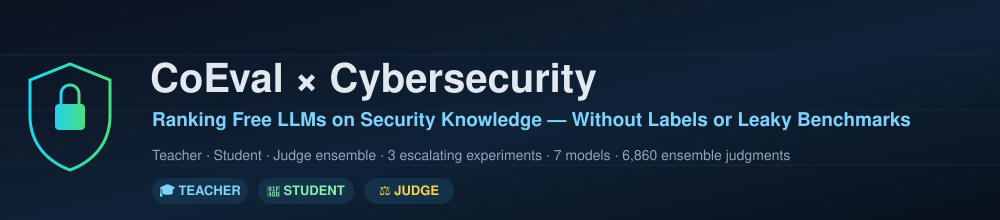
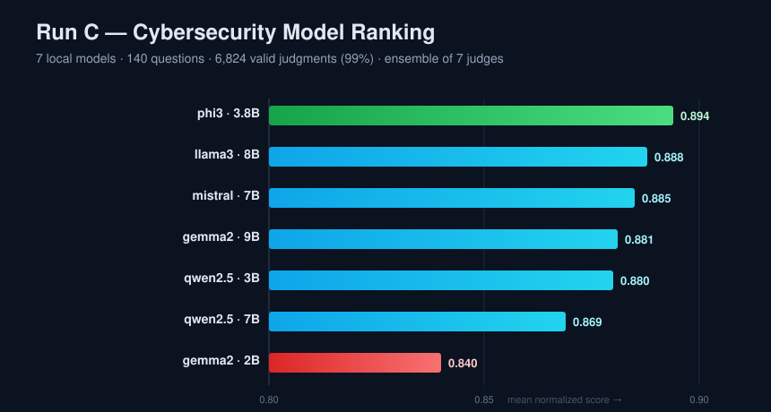
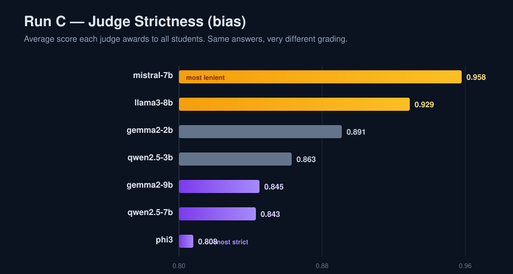

<p align="center">
  
</p>

<p align="center">
  
  
  
  
  
  
  
</p>

<p align="center">
  <b>A capstone study that applies <a href="https://github.com/ApartsinProjects/CoEval">CoEval</a> — an ensemble-based, label-free LLM-evaluation framework — to rank freely available language models on <b>cybersecurity</b> knowledge and reasoning, and tests the framework's own published claims on a new domain.</b>
</p>

<p align="center">
  📄 <b>Instructor's paper:</b> <a href="https://apartsinprojects.github.io/CoEval/">CoEval: Ranking Language Models for Custom Tasks Without Labeled Data or Trustworthy Benchmarks</a> · Dr. Alexander Apartsin & Dr. Yehudit Aperstein
</p>

---

## Table of Contents

1. [Abstract](#1-abstract)
2. [Background: the CoEval framework and the claims we test](#2-background-the-coeval-framework-and-the-claims-we-test)
3. [Our study: domain and methodology](#3-our-study-domain-and-methodology)
4. [Experimental design: three escalating runs](#4-experimental-design-three-escalating-runs)
5. [Results](#5-results)
6. [Did our experiments confirm the paper's claims?](#6-did-our-experiments-confirm-the-papers-claims)
7. [Live, viewable reports for every run](#7-live-viewable-reports-for-every-run)
8. [Repository structure](#8-repository-structure)
9. [Reproduce it yourself](#9-reproduce-it-yourself)
10. [Acknowledgements](#10-acknowledgements)

---

## 1. Abstract

Selecting the best Large Language Model (LLM) for a specialized domain is difficult: public
leaderboards may be **contaminated** by pretraining leakage, and constructing a labeled benchmark is
a research project in itself. The **CoEval** framework, developed by the course instructor, addresses
this by letting a pool of models evaluate *one another* through three rotating roles — **Teacher**
(authors fresh questions), **Student** (answers them), and **Judge** (scores them against an
automatically generated rubric) — with no human labels at any stage.

This project applies CoEval end-to-end to **cybersecurity**, using exclusively **free** models
(local models served via [Ollama](https://ollama.com) and free-tier APIs via
[OpenRouter](https://openrouter.ai)). We designed **three escalating experiments**, growing from a
partial 2-model cloud run to a complete **7-model, 140-question, 6,860-judgment** local run, and we
use the results to independently test the central claims of the instructor's paper on a domain and
model pool it never covered. Our findings **reproduce and extend** the paper's core results:
single-judge bias is large but is cancelled by the ensemble, judge composition dominates
reliability, and — strikingly — **model scale does not determine quality**.

---

## 2. Background: the CoEval framework and the claims we test

CoEval ranks models for a *custom* task in the hardest setting — when no task-specific labeled data
exists and public benchmarks cannot be trusted. From a task description alone, **Teacher** models
synthesize a fresh, contamination-free benchmark, and a **Judge** ensemble scores the **Student**
candidates. The instructor's paper advances three central, *measured* claims that our study is
designed to test:

| # | Claim from the paper | How we test it in this study |
|:-:|:---------------------|:-----------------------------|
| **C1** | **Judge composition is a first-order variable** in evaluation reliability — *who* judges matters more than *how many*. | We run an ensemble of up to 7 judges on identical answers and measure how widely their awarded scores diverge. |
| **C2** | **A multi-judge ensemble cancels single-judge bias** that no individual judge avoids. | We compare each judge's idiosyncratic ranking against the aggregated consensus ranking for stability. |
| **C3** | **Small models are unreliable judges.** | Our pool spans 2B → 9B; we examine which judges are erratic and which produce malformed (unparseable) scores. |
| **C4** | **Rankings are domain-specific**, so a generic leaderboard misleads. | We rank on a *cybersecurity* benchmark and compare the ordering to general-purpose expectations. |
| **C5** | **Closed-loop LLM evaluation is cheap and fully automatable.** | We execute ~8,000 judgments end-to-end with zero human labels and zero API cost (local inference). |

> A complete, faithful summary of the paper — its problem statement, method, all three hypotheses,
> measured results, what was proven, and the authors' own stated limitations — is woven through
> §[6](#6-did-our-experiments-confirm-the-papers-claims). We note that the framework's *marketing*
> README reports stronger, rounded numbers than the *paper*, several of which the paper explicitly
> flags as **projections pending measurement**; we anchor our comparison to the paper's **measured**
> claims (C1–C5).

---

## 3. Our study: domain and methodology

### 3.1 Why cybersecurity?

Cybersecurity is an excellent differentiator for LLM evaluation because a correct answer demands a
combination of precise terminology, conceptual understanding (CIA triad, cryptography, attack
taxonomies), and applied reasoning over scenarios. It is also a domain where **leakage is rampant**
(OWASP guides, CVE write-ups, and security quizzes saturate the public web), which makes CoEval's
contamination-free generation especially valuable. The concepts that frame the benchmark are
documented in **[docs/01-domain-background.md](docs/01-domain-background.md)**.

### 3.2 Task specification and automatic provisioning

We defined a single task — *"Cybersecurity knowledge and reasoning assessment"* — and let CoEval
infer the rest. In the cloud run (A) we used **fully automatic** attribute and rubric generation; the
framework independently recovered a domain-faithful structure (sub-topics such as *Network Security*,
*Web Application Security*, *Cryptography*, *Malware Analysis*; difficulty tiers
*Fundamental → Expert*) and a 19-factor rubric centered on *technical accuracy*, *terminology*, and
*practical insight* — exactly the criteria a human expert would use. Full details:
**[docs/02-methodology.md](docs/02-methodology.md)**.

### 3.3 Models evaluated

```
┌──────────────────────────────────────────────────────────────┐
│                   MODEL  ENSEMBLE  (Run C: 7 models)          │
│                                                                │
│   llama3-8b · gemma2-2b · gemma2-9b · qwen2.5-3b               │
│   qwen2.5-7b · phi3 · mistral-7b  — every model plays every role
│                                                                │
│        ┏━━━━━━━━━━━━━ ROTATING ROLE ASSIGNMENT ━━━━━━━━━━━┓     │
│        ▼                       ▼                        ▼      │
│   🎓 TEACHER              📝 STUDENT               ⚖️ JUDGE     │
│  writes fresh           answers every            scores every  │
│  cybersecurity Qs       teacher's questions      answer 0–1    │
└──────────────────────────────────────────────────────────────┘
```

Five vendors are represented (Meta, Google, Alibaba, Microsoft, Mistral), and two **same-vendor size
pairs** (gemma2 2B↔9B, qwen2.5 3B↔7B) are included specifically to test whether bigger models score
higher. CoEval's five-phase pipeline (attribute mapping → rubric mapping → data generation → response
collection → evaluation) runs every model through all three roles.

---

## 4. Experimental design: three escalating runs

The study is deliberately structured as an **evolution**: each run answers a question raised by the
previous one. Every run has its own fully documented findings file with the structure *what we tested
· results · success or failure · problems and how we fixed them (temporary vs. fundamental) ·
conclusions · how it differs from the previous run*.

| Run | Tier | Models | Questions | Outcome | Detailed write-up |
|:---:|:-----|:------:|:---------:|:--------|:------------------|
| **A** | Cloud free-tier + 1 local | 4 (2 usable) | 12 | ⚠️ Partial — revealed the free-API ceiling | [docs/03-run-A-findings.md](docs/03-run-A-findings.md) |
| **B** | Fully local (Ollama) | 4 | 12 | ✅ Complete — first clean ranking | [docs/04-run-B-findings.md](docs/04-run-B-findings.md) |
| **C** | Fully local — **large** | **7** | **20** | ✅ Complete — the capstone result | [docs/05-run-C-findings.md](docs/05-run-C-findings.md) |

> The complete chronological log of **every** run — including four early failed configurations and
> exactly how each was diagnosed and fixed — is in **[docs/00-run-log.md](docs/00-run-log.md)**.

---

## 5. Results

### 5.1 Final ranking (Run C: 7 models, 140 questions, 6,824 valid judgments, 99%)

<p align="center"></p>

| Rank | Model | Vendor | Size | Mean score |
|:----:|:------|:-------|:----:|:----------:|
| 🥇 | **phi3** | Microsoft | 3.8B | **0.894** |
| 🥈 | llama3 | Meta | 8B | 0.888 |
| 🥉 | mistral | Mistral | 7B | 0.885 |
| 4 | gemma2 | Google | 9B | 0.881 |
| 5 | qwen2.5 | Alibaba | 3B | 0.880 |
| 6 | qwen2.5 | Alibaba | 7B | 0.869 |
| 7 | gemma2 | Google | 2B | 0.840 |

### 5.2 Judge strictness — the same answers, graded very differently

<p align="center"></p>

The mean score a judge awards ranges from **0.808 (phi3, harshest)** to **0.958 (mistral, most
lenient)** — a 0.15 gap on *identical* student answers. This is direct, domain-independent evidence
for the paper's claim that judge identity is a first-order variable.

---

## 6. Did our experiments confirm the paper's claims?

Each verdict below is **stated, then justified with our own evidence and a concrete example.**

### ✅ C1 — Judge composition is a first-order variable — **Confirmed**
In Run C the seven judges awarded mean scores spanning **0.808 → 0.958** on the same pool of answers
(see §5.2). *Example:* the student `gemma2-2b` received **0.745** from judge `phi3` but **0.941**
from judge `mistral-7b` — a 0.20 swing driven purely by *who* graded. This mirrors the paper's
κ = 0.003 → 0.422 agreement range: the choice of judges, not their count, dominates.

### ✅ C2 — The ensemble cancels single-judge bias — **Confirmed**
Despite that strictness spread, the **aggregated ranking is stable**: `phi3` is ranked #1 by every
one of the seven judges, and `gemma2-2b` is last under six of seven. *Example:* the lenient judge
`mistral-7b` and the harsh judge `phi3` disagree on absolute scores by ~0.15, yet **both** place phi3
first and gemma2-2b last — so the consensus ordering survives even though no single judge's numbers
do. This is precisely the bias-cancellation the paper attributes to ensemble aggregation.

### ✅ C3 — Small models are unreliable judges — **Confirmed**
The smallest model, `gemma2-2b` (2B), was simultaneously the harshest-but-noisiest judge and the
weakest student (0.840). In Run A the small free-tier judges (`nemotron-nano-9b`, `gemma`) produced
the bulk of the **invalid, unparseable judgments** (only 51% of Run A's judgments were well-formed),
and in early Run B attempts the 2–3B models could not emit the structured JSON that attribute/rubric
generation requires at all — forcing us to supply an explicit rubric. Reliability as a *judge* is a
distinct, scale-sensitive capability, exactly as the paper reports for sub-2B models.

### ✅/➕ C4 — Rankings are domain-specific (and scale ≠ quality) — **Confirmed and extended**
On *cybersecurity*, the 3.8B **phi3 beat the 8B llama3 and the 7B mistral**, and within a single
family the smaller model sometimes won outright:

| Family | Small | Large | Winner |
|:-------|:-----:|:-----:|:------:|
| Gemma 2 | 2B → 0.840 | 9B → 0.881 | bigger ⬆️ |
| Qwen 2.5 | 3B → **0.880** | 7B → 0.869 | **smaller** ⬇️ |

A generic "bigger/newer is better" leaderboard would mis-rank this domain — strengthening the paper's
domain-specificity claim. Microsoft's Phi family, trained on dense textbook-style technical data,
punches far above its parameter count on a knowledge-intensive domain like security.

### ✅ C5 — Cheap and fully automatable — **Confirmed (and stronger)**
We produced **6,860 judgments at $0.00** — the paper's pipeline cost $5.89 on paid APIs, whereas our
fully-local execution cost nothing beyond electricity, with **zero human labels** and **zero manual
intervention** between phases. The trade-off we document is **time, not money**: on a 13.7 GB laptop
the run spanned several days of checkpointed, resumable execution.

### ❓ Where we are more cautious than the marketing numbers
The paper itself flags its baseline-superiority figures (vs. G-Eval/BERTScore) as **projections**.
We make no such comparison and report only what we measured. We also did **not** collect a
ground-truth human ranking for cybersecurity, so — like the paper — our ranking has *face validity*
(it is sensible and internally consistent) rather than a verified correlation to human judgment.

> The full claim-by-claim analysis, with per-run contributions and the limitations of our own study,
> is in **[docs/06-conclusions.md](docs/06-conclusions.md)**.

---

## 7. Live, viewable reports for every run

CoEval emits self-contained interactive HTML dashboards. Because GitHub does not render HTML inline,
the links below open each report **rendered in your browser** via `htmlpreview` — so anyone can *see*
the experiment's results directly, no download required.

### Run C — the large final run
| Report | What it shows |
|:-------|:--------------|
| [📊 Dashboard](https://htmlpreview.github.io/?https://raw.githubusercontent.com/itaym26/coeval-cybersecurity-eval/main/runs/run-C-local/reports/index.html) | All reports in one place, with top-line rankings |
| [🎓 Student Report](https://htmlpreview.github.io/?https://raw.githubusercontent.com/itaym26/coeval-cybersecurity-eval/main/runs/run-C-local/reports/student_report/index.html) | Per-model scores, rubric-factor heatmaps |
| [⚖️ Judge Report](https://htmlpreview.github.io/?https://raw.githubusercontent.com/itaym26/coeval-cybersecurity-eval/main/runs/run-C-local/reports/judge_report/index.html) | Judge bias, calibration, reliability |
| [🔗 Judge Consistency](https://htmlpreview.github.io/?https://raw.githubusercontent.com/itaym26/coeval-cybersecurity-eval/main/runs/run-C-local/reports/judge_consistency/index.html) | Inter-judge agreement (ICC) |
| [🧩 Interaction Matrix](https://htmlpreview.github.io/?https://raw.githubusercontent.com/itaym26/coeval-cybersecurity-eval/main/runs/run-C-local/reports/interaction_matrix/index.html) | Teacher × Student quality heatmap |
| [📈 Score Distribution](https://htmlpreview.github.io/?https://raw.githubusercontent.com/itaym26/coeval-cybersecurity-eval/main/runs/run-C-local/reports/score_distribution/index.html) | High/Medium/Low histograms |

### Run B — first complete local run
[📊 Dashboard](https://htmlpreview.github.io/?https://raw.githubusercontent.com/itaym26/coeval-cybersecurity-eval/main/runs/run-B-local/reports/index.html) · [🎓 Student](https://htmlpreview.github.io/?https://raw.githubusercontent.com/itaym26/coeval-cybersecurity-eval/main/runs/run-B-local/reports/student_report/index.html) · [⚖️ Judge](https://htmlpreview.github.io/?https://raw.githubusercontent.com/itaym26/coeval-cybersecurity-eval/main/runs/run-B-local/reports/judge_report/index.html)

### Run A — partial cloud run
[📊 Dashboard](https://htmlpreview.github.io/?https://raw.githubusercontent.com/itaym26/coeval-cybersecurity-eval/main/runs/run-A-cloud-free/reports/index.html) · [🎓 Student](https://htmlpreview.github.io/?https://raw.githubusercontent.com/itaym26/coeval-cybersecurity-eval/main/runs/run-A-cloud-free/reports/student_report/index.html) · [⚖️ Judge](https://htmlpreview.github.io/?https://raw.githubusercontent.com/itaym26/coeval-cybersecurity-eval/main/runs/run-A-cloud-free/reports/judge_report/index.html)

> An Excel workbook (`complete_report.xlsx`) and all raw JSONL artifacts are included under each
> run's folder in [`runs/`](runs/).

---

## 8. Repository structure

```
coeval-cybersecurity-eval/
├── README.md                       ← this file
├── config/                         the three experiment configs (A / B / C)
├── runs/
│   ├── run-A-cloud-free/           artifacts + interactive reports + ranking script
│   ├── run-B-local/
│   └── run-C-local/                the large final run
├── docs/
│   ├── 00-run-log.md               chronological log of every run (cause/fix of each issue)
│   ├── 01-domain-background.md      cybersecurity concepts primer
│   ├── 02-methodology.md           CoEval mechanics + our configuration
│   ├── 03-run-A-findings.md        Run A — full write-up
│   ├── 04-run-B-findings.md        Run B — full write-up
│   ├── 05-run-C-findings.md        Run C — full write-up
│   └── 06-conclusions.md           comparative conclusions + paper alignment
├── scripts/                        RAM-safe overnight run scripts
└── figures/                        charts (banner, ranking, judge strictness)
```

---

## 9. Reproduce it yourself

```bash
# 1. Install the CoEval framework
git clone https://github.com/ApartsinProjects/CoEval.git && cd CoEval
python -m pip install -e .

# 2. Pull the local models (Ollama) — fully free, no API keys
ollama pull llama3:8b  gemma2:2b  gemma2:9b
ollama pull qwen2.5:3b qwen2.5:7b phi3  mistral:7b

# 3. Probe → plan → run → analyze
coeval probe   --config config/cybersecurity_runC.yaml
coeval plan    --config config/cybersecurity_runC.yaml
coeval run     --config config/cybersecurity_runC.yaml
coeval analyze all --run Runs/cybersecurity-run-C-large --out reports
```

> On a memory-limited machine, set `OLLAMA_MAX_LOADED_MODELS=1` so only one model is resident at a
> time; the resilient overnight runner we used is in [scripts/](scripts/).

---

## 10. Acknowledgements

The **CoEval** framework and paper are the work of **Dr. Alexander Apartsin** and
**Dr. Yehudit Aperstein** — <https://github.com/ApartsinProjects/CoEval>. All experiment
configurations, runs, analyses, figures, and documentation in this repository are student capstone
work built **on top of** that framework.
